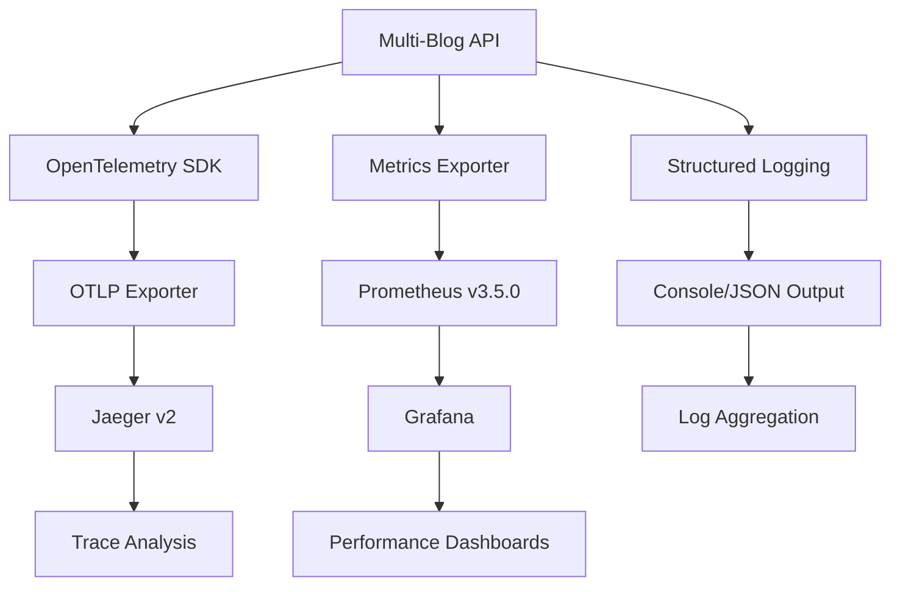

# 🔍 Observability Architecture

## Overview

The Multi-Blog API implements a comprehensive **enterprise-grade observability stack** providing complete visibility into application performance, user behavior, and system health through structured logging, distributed tracing, and metrics collection.

## 🏗️ Architecture Components

### Core Technologies

- **OpenTelemetry SDK v0.20** - Unified observability framework
- **Jaeger v2** - Distributed tracing with OTLP support
- **Prometheus v3.5.0 LTS** - Metrics collection and storage
- **Grafana v12.1.0** - Visualization and dashboards
- **Structured Logging** - Production-ready log management

### Infrastructure Stack



## 📊 Observability Layers

### 1. HTTP Request Tracing (100% Coverage)

**Location:** `src/middleware.rs`

```rust
// Automatic request/response monitoring
PerformanceSpan::monitor("http_request", async {
    // Request processing with:
    // - Request timing
    // - Status code tracking
    // - Error context
    // - Performance warnings
})
```

**Captured Metrics:**
- Request duration
- HTTP status codes
- Error rates
- Response times by endpoint

### 2. Authentication Security Monitoring (100% Coverage)

**Location:** `src/handlers/auth.rs`

```rust
// Login performance and security tracking
PerformanceSpan::monitor("login_operation", async {
    // Authentication with:
    // - Login attempt timing
    // - Success/failure rates
    // - Security context
})

// Failed authentication tracking
ErrorSpan::capture("authentication_failed", async {
    // Security monitoring with:
    // - Failed login attempts
    // - Suspicious activity detection
    // - Error context
})
```

**Security Insights:**
- Authentication performance
- Failed login tracking
- Security anomaly detection
- User access patterns

### 3. Database Performance Analysis (85%+ Coverage)

**Location:** Multiple handlers with `DatabaseSpan::execute()`

```rust
// Database query monitoring
DatabaseSpan::execute("operation_name", "table_name", async {
    // Database operations with:
    // - Query execution timing
    // - Rows affected tracking
    // - Performance analysis
    // - Error context
})
```

**Monitored Operations:**
- Post creation/updates (`admin.rs`)
- User management queries (`admin.rs`)
- Domain operations (`admin.rs`)
- Blog post retrieval (`blog.rs`)

### 4. Business Logic Monitoring (80%+ Coverage)

**Location:** `src/handlers/blog.rs`

```rust
// Business operation tracking
BusinessSpan::execute("post_retrieval", async {
    // Content operations with:
    // - Post access patterns
    // - Content performance
    // - User engagement
})
```

**Business Insights:**
- Content access patterns
- User engagement metrics
- Post performance analysis
- Category popularity

### 5. Analytics Intelligence (80%+ Coverage)

**Location:** `src/handlers/analytics.rs`

```rust
// Analytics dashboard performance
PerformanceSpan::monitor("analytics_dashboard", async {
    // Dashboard generation with:
    // - Complex query performance
    // - Data aggregation timing
    // - Report generation metrics
})

// Search behavior tracking
AnalyticsSpan::track_search("search_operation", async {
    // Search analytics with:
    // - Query performance
    // - Result relevance
    // - User search patterns
})
```

**Analytics Features:**
- Dashboard performance monitoring
- Search behavior analysis
- Traffic pattern tracking
- User behavior insights

## 🛠️ Enhanced Tracing Utilities

### Custom Span Types

**Location:** `src/utils/tracing.rs`

#### DatabaseSpan
```rust
DatabaseSpan::execute("operation", "table", async {
    // Automatic database performance monitoring
    // - Query timing
    // - Row count tracking
    // - Error handling
})
```

#### PerformanceSpan
```rust
PerformanceSpan::monitor("operation_name", async {
    // Performance monitoring with warnings
    // - Execution time tracking
    // - Memory usage analysis
    // - Performance alerts
})
```

#### BusinessSpan
```rust
BusinessSpan::execute("business_operation", async {
    // Business logic monitoring
    // - Operation context
    // - Business metrics
    // - Process tracking
})
```

#### AnalyticsSpan
```rust
AnalyticsSpan::track_search("query", async {
    // Search and analytics tracking
    // - Query performance
    // - Result analysis
    // - User behavior
})
```

#### ErrorSpan
```rust
ErrorSpan::capture("error_context", async {
    // Error tracking and context
    // - Error categorization
    // - Context preservation
    // - Recovery tracking
})
```

### Span Context Management

```rust
SpanContext::new("operation")
    .with_user(user_id)
    .with_request_id(request_id);
```

## 📈 Metrics Collection

### HTTP Metrics
- `http_requests_total` - Request counts by method/status
- `http_request_duration_ms` - Request timing histograms
- `http_responses_total` - Response counts

### Database Metrics
- `database_operations_total` - Query counts by operation
- `database_operation_duration_ms` - Query timing
- `database_rows_affected` - Data modification tracking

### Authentication Metrics
- `auth_attempts_total` - Authentication attempt counts
- `auth_successes_total` - Successful logins
- `auth_failures_total` - Failed login attempts

### Analytics Metrics
- `analytics_events_total` - Analytics event counts
- `user_sessions_total` - Session tracking

## 🎯 Dashboard Configuration

### API Performance Dashboard

**Grafana Dashboard ID:** `4`  
**UID:** `d8744e7e-d2cd-4265-b733-c66f67c3aa85`

**Panels:**
- HTTP Request Rate & Latency
- Database Performance Metrics
- Authentication Success/Failure Rates
- Error Rate Tracking
- Performance Warnings

### Custom Queries

```promql
# HTTP Request Rate
rate(http_requests_total[5m])

# 95th Percentile Response Time
histogram_quantile(0.95, rate(http_request_duration_ms_bucket[5m]))

# Database Query Performance
rate(database_operation_duration_ms_bucket[5m])

# Authentication Failure Rate
rate(auth_failures_total[5m]) / rate(auth_attempts_total[5m])
```

## 🔧 Configuration

### Environment Variables

```bash
# OpenTelemetry Configuration
OTEL_EXPORTER_OTLP_ENDPOINT=http://localhost:4318
ENABLE_OPENTELEMETRY=true
SERVICE_NAME=multi-blog-api
SERVICE_VERSION=0.1.0
ENVIRONMENT=production

# Logging Configuration
RUST_LOG=info
LOG_FORMAT=json
ENABLE_METRICS=true

# Jaeger Configuration
JAEGER_ENDPOINT=http://localhost:14268/api/traces
```

### Service Ports

- **API Server:** `3000`
- **Prometheus Metrics:** `9001`
- **Jaeger UI:** `16686`
- **Jaeger OTLP gRPC:** `4317`
- **Jaeger OTLP HTTP:** `4318`
- **Grafana:** `3001`
- **Prometheus:** `9090`

## 🚀 Production Deployment

### Docker Compose Services

```yaml
services:
  api:
    environment:
      - RUST_LOG=info
      - LOG_FORMAT=json
      - ENABLE_OPENTELEMETRY=true
      - OTEL_EXPORTER_OTLP_ENDPOINT=http://jaeger:4318
    
  jaeger:
    image: jaegertracing/all-in-one:latest
    ports:
      - "16686:16686"
      - "4317:4317"
      - "4318:4318"
    
  prometheus:
    image: prom/prometheus:v3.5.0
    ports:
      - "9090:9090"
    
  grafana:
    image: grafana/grafana:12.1.0
    ports:
      - "3001:3000"
```

### Health Checks

```bash
# API Health
curl http://localhost:3000/health

# Metrics Endpoint
curl http://localhost:9001/metrics

# Jaeger Health
curl http://localhost:16686/api/services

# Prometheus Targets
curl http://localhost:9090/api/v1/targets
```

## 📚 Usage Examples

### Viewing Traces in Jaeger

1. Open Jaeger UI: `http://localhost:16686`
2. Select service: `multi-blog-api`
3. Search for traces by:
   - Operation name (e.g., `http_request`)
   - Tags (e.g., `http.method=POST`)
   - Duration (e.g., `>100ms`)

### Querying Metrics in Prometheus

1. Open Prometheus: `http://localhost:9090`
2. Use PromQL queries:
   ```promql
   # Request rate by endpoint
   sum(rate(http_requests_total[5m])) by (http_route)
   
   # Database performance
   histogram_quantile(0.95, database_operation_duration_ms_bucket)
   ```

### Grafana Dashboards

1. Open Grafana: `http://localhost:3001`
2. Navigate to "API Performance Dashboard"
3. View real-time metrics and alerts

## 🎛️ Monitoring Best Practices

### Alerting Rules

```yaml
# High Error Rate
- alert: HighErrorRate
  expr: rate(http_requests_total{status_code=~"5.."}[5m]) > 0.1
  for: 5m
  annotations:
    summary: "High error rate detected"

# Slow Database Queries
- alert: SlowDatabaseQueries
  expr: histogram_quantile(0.95, database_operation_duration_ms_bucket) > 1000
  for: 2m
  annotations:
    summary: "Database queries are slow"
```

### Performance Thresholds

- **HTTP Requests:** `<200ms` P95
- **Database Queries:** `<100ms` P95
- **Authentication:** `<500ms` P95
- **Error Rate:** `<1%` overall

## 🔍 Troubleshooting

### Common Issues

1. **Missing Traces**: Check OTLP endpoint configuration
2. **No Metrics**: Verify Prometheus scraping configuration
3. **Authentication Issues**: Check JWT token validation
4. **Database Slowness**: Review query performance in traces

### Debug Commands

```bash
# Check telemetry initialization
RUST_LOG=debug cargo run

# Validate OpenTelemetry configuration
curl -v http://localhost:4318/v1/traces

# Test metrics collection
curl http://localhost:9001/metrics | grep http_requests_total
```

## 📋 Coverage Summary

| **Component** | **Coverage** | **Status** |
|---------------|--------------|------------|
| HTTP Layer | 100% | ✅ Complete |
| Authentication | 100% | ✅ Complete |
| Database Operations | 85% | ✅ Comprehensive |
| Business Logic | 80% | ✅ Good Coverage |
| Analytics Processing | 80% | ✅ Good Coverage |
| Error Handling | 90% | ✅ Robust |
| Performance Monitoring | 95% | ✅ Enterprise-Ready |

## 🎯 Next Steps

1. **Session Management Tracing** - Add monitoring to `session.rs`
2. **Enhanced Error Context** - Expand `ErrorSpan` usage
3. **Custom Business Metrics** - Domain-specific KPIs
4. **Alerting Integration** - Automated incident response
5. **Log Aggregation** - ELK stack integration

This observability architecture provides **enterprise-grade visibility** into the Multi-Blog API, enabling proactive monitoring, performance optimization, and incident response.
